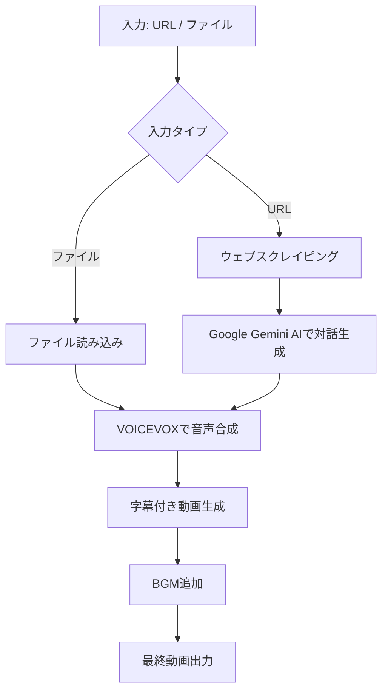

# VOICEVOX Video Generator

このプロジェクトは、指定されたウェブサイト、GitHubリポジトリ、またはテキストファイルからコンテンツを取得し、そのコンテンツに基づいて対話を生成し、VOICEVOXを使用して音声を合成し、最終的に字幕付きの動画を作成するツールです。

## 機能

- ウェブサイトやGitHubリポジトリからのコンテンツスクレイピング
- テキストファイルからの対話読み込み
- Google Gemini AIを使用した対話生成
- VOICEVOXによる音声合成
- 字幕付き動画の生成

## セットアップ

1. リポジトリをクローンします：

   ```bash
   git clone [your-repo-url]
   cd [your-repo-name]
   ```

2. 必要な依存関係をインストールします：

   ```bash
   pip install -r requirements.txt
   ```

3. 日本語フォントをインストールします：

   ```bash
   sudo apt-get install -y fonts-noto-cjk
   ```

4. ffmpegをインストールします：

   ```bash
   sudo apt-get install -y ffmpeg
   ```

5. VOICEVOXエンジンを起動します。Docker環境の場合：

   ```bash
   docker run -p 50021:50021 voicevox/voicevox_engine:cpu-ubuntu20.04-latest
   ```

6. ユーザー辞書を追加します：

   ```bash
   python3 user_dict/user_dict_manager.py
   ```

7. 環境変数を設定します：

   ```bash
   export GEMINI_API_KEY=your_gemini_api_key
   export VOICEVOX_API_HOST=localhost  # VOICEVOXエンジンのホスト
   ```

## 使用方法

1. URLを指定して実行：

   ```bash
   python3 main.py https://example.com
   ```

2. GitHubリポジトリのURLを指定して実行：

   ```bash
   python3 main.py https://github.com/username/repository
   ```

3. テキストファイルを指定して実行：

   ```bash
   python3 main.py path/to/your/dialogue.txt
   ```

   テキストファイルの形式：

   ```text
   ずんだもん: [ずんだもんの発言]
   四国めたん: [四国めたんの発言]
   ずんだもん: [ずんだもんの発言]
   四国めたん: [四国めたんの発言]
   ...
   ```

4. デフォルトのダイアログ生成を使用：

   ```bash
   python3 main.py
   ```

## 処理の流れ

以下は、このプロジェクトの処理の大きな流れを示すMermaid図です：



## ライセンス

このプロジェクトはMITライセンスの下で公開されています。

## フィードバック

ご感想やフィードバックは[Twitter](https://x.com/aegisfleet)でお知らせください。

## 注意事項

- このプロジェクトはVOICEVOXの利用規約に従って使用してください。
- 生成されたコンテンツの著作権や利用に関する責任は利用者にあります。
- スクレイピングを行う際は、対象ウェブサイトの利用規約を遵守してください。
