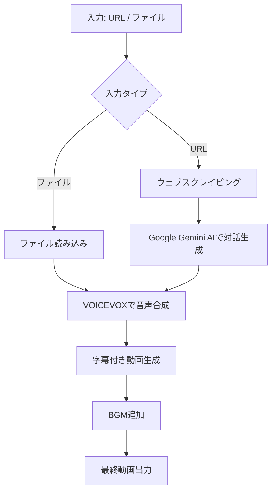

# VOICEVOX Video Generator

このプロジェクトは、指定されたウェブサイト、GitHubリポジトリ、またはテキストファイルからコンテンツを取得し、そのコンテンツに基づいて対話を生成し、VOICEVOXを使用して音声を合成し、最終的に字幕付きの動画を作成するツールです。

https://github.com/user-attachments/assets/5b911c2f-d432-4906-9e6a-c54130f01904

## 機能

- ウェブサイトやGitHubリポジトリからのコンテンツスクレイピング
- テキストファイルからの対話読み込み
- Google Gemini AIを使用した対話生成
  - 長さの異なる対話（短い/長い）の生成
- VOICEVOXによる音声合成
  - 複数のキャラクターの対話生成
- 字幕付き動画の生成（横動画・縦動画に対応）
  - 動画へのBGM追加
  - テロップのアニメーション効果

## セットアップ

1. リポジトリをクローンします：

   ```bash
   git clone https://github.com/aegisfleet/voicevox2video.git
   cd voicevox2video
   ```

2. 必要な依存関係をインストールします：

   ```bash
   pip install -r requirements.txt
   ```

3. 日本語フォントをインストールします：

   ```bash
   sudo apt-get install -y fonts-noto-cjk
   ```

4. ffmpegをインストールします：

   ```bash
   sudo apt-get install -y ffmpeg
   ```

5. VOICEVOXエンジンを起動します。Docker環境の場合：

   ```bash
   docker run -p 50021:50021 voicevox/voicevox_engine:cpu-ubuntu20.04-latest
   ```

6. ユーザー辞書を追加します：

   ```bash
   python3 user_dict/user_dict_manager.py
   ```

7. 環境変数を設定します：

   ```bash
   export GEMINI_API_KEY=your_gemini_api_key
   export VOICEVOX_API_HOST=localhost  # VOICEVOXエンジンのホスト
   ```

## 使用方法

スクリプトの実行時に、以下のパラメータを指定できます：

- 第1引数: URL、GitHubリポジトリ、またはテキストファイルのパス
- 第2引数: キャラクター1の名前（省略可能、デフォルト: "ずんだもん"）
- 第3引数: キャラクター2の名前（省略可能、デフォルト: "四国めたん"）
- 第4引数: 長い対話を生成する場合は "1"、そうでない場合は省略または他の値
- 第5引数: 縦動画を生成する場合は "1"、そうでない場合は省略または他の値

例：

1. URLを指定して実行（横動画、短い対話）：

   ```bash
   python3 main.py https://example.com
   ```

2. GitHubリポジトリのURLを指定して実行（縦動画、長い対話）：

   ```bash
   python3 main.py https://github.com/username/repository ずんだもん 四国めたん 1 1
   ```

3. テキストファイルを指定して実行（横動画、短い対話、カスタムキャラクター）：

   ```bash
   python3 main.py path/to/your/dialogue.txt 春日部つむぎ 四国めたん
   ```

   テキストファイルの形式：

   ```text
   キャラクター1: [キャラクター1の発言]
   キャラクター2: [キャラクター2の発言]
   キャラクター1: [キャラクター1の発言]
   キャラクター2: [キャラクター2の発言]
   ```

### 対話シナリオの生成

generate_scenario.pyを直接実行することで、対話のシナリオのみを生成することができます。

```bash
python3 generate_scenario.py [URL]
```

これにより、指定されたURLの内容に基づいて対話シナリオが生成され、`output/generated_dialogue.txt`にファイル出力されます。生成されたファイルは、main.pyの引数に指定して使用できます。

## 処理の流れ

以下は、このプロジェクトの処理の大きな流れを示すMermaid図です：



## 新機能

1. **複数キャラクターのサポート**: 11種類のVOICEVOXキャラクターから選択可能になりました。
2. **対話の長さ制御**: 短い対話と長い対話を生成できるようになりました。

## ライセンス

このプロジェクトはMITライセンスの下で公開されています。

## フィードバック

ご感想やフィードバックは[Twitter](https://x.com/aegisfleet)でお知らせください。

## 注意事項

- このプロジェクトはVOICEVOXの利用規約に従って使用してください。
- 生成されたコンテンツの著作権や利用に関する責任は利用者にあります。
- スクレイピングを行う際は、対象ウェブサイトの利用規約を遵守してください。
