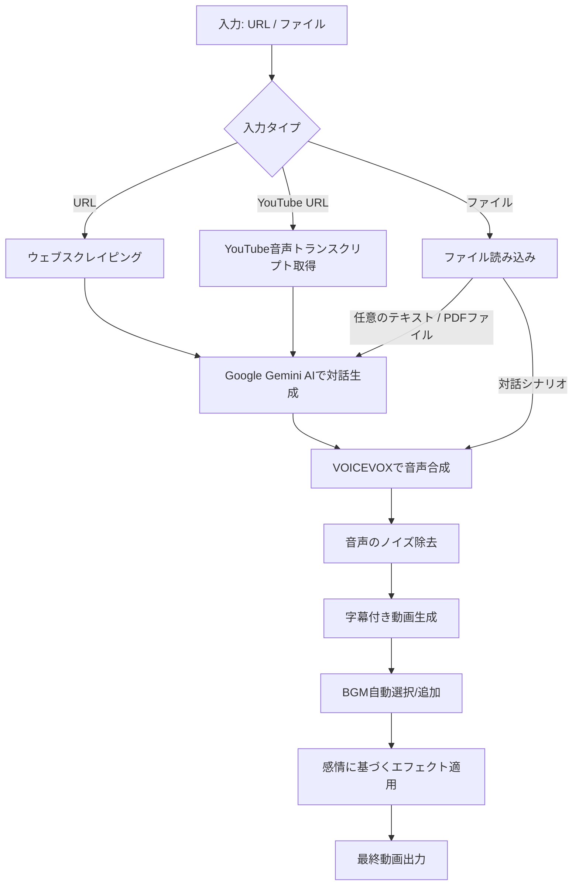

# VOICEVOX Video Generator

このプロジェクトは、指定されたウェブサイト（GitHub / YouTube / Amazon など）、PDFファイル、または任意のテキストファイルからコンテンツを取得し、そのコンテンツに基づいて対話を生成し、VOICEVOXを使用して音声を合成し、最終的に字幕付きの動画を作成するツールです。

https://github.com/user-attachments/assets/8f00ca43-a764-4756-bca0-6d5eb74c3d8b

## 機能

- 様々なインプットに対応
  - ウェブサイトやGitHub、AmazonのURLからコンテンツをスクレイピング
  - YouTubeビデオの音声トランスクリプトからコンテンツ取得
  - PDFファイルからコンテンツ取得
  - 任意のテキストファイル
- Google Gemini AIを使用した対話シナリオの生成
  - 長さの異なる対話（短い/長い）の生成
  - 任意のテキストファイルからの対話シナリオ生成
- VOICEVOXによる音声合成
  - 複数のキャラクターの対話生成
- 字幕付き動画の生成（横動画・縦動画に対応）
  - 音声のノイズ除去処理
  - 動画へのBGM追加
    - 自動BGM選択機能
  - テロップのアニメーション効果
  - 生成された対話のタイトルを動画上部に表示
  - 対話シナリオに含まれる絵文字に基づいて、動画に適切なエフェクトを自動で適用

## セットアップ

1. リポジトリをクローンします：

   ```bash
   git clone https://github.com/aegisfleet/voicevox2video.git
   cd voicevox2video
   ```

2. 必要な依存関係をインストールします：

   ```bash
   pip install -r requirements.txt
   ```

3. 日本語フォントをインストールします：

   ```bash
   sudo apt-get install -y fonts-noto-cjk
   ```

4. ffmpegをインストールします：

   ```bash
   sudo apt-get install -y ffmpeg
   ```

5. VOICEVOXエンジンを起動します。Docker環境の場合：

   ```bash
   docker run -p 50021:50021 voicevox/voicevox_engine:cpu-ubuntu20.04-latest
   ```

6. ユーザー辞書を追加します：

   ```bash
   python3 user_dict/user_dict_manager.py
   ```

7. Google Gemini API キーを設定します：

   a. 環境変数を使用する場合：

   ```bash
   export GEMINI_API_KEY=your_gemini_api_key
   ```

   b. ファイルを使用する場合：

   ```bash
   echo "your_gemini_api_key" > .gemini_api_key
   ```

   注意: `.gemini_api_key` ファイルは `.gitignore` に追加されているため、Git の追跡対象外となります。

8. VOICEVOX API ホストを設定します：

   ```bash
   export VOICEVOX_API_HOST=localhost  # VOICEVOXエンジンのホスト
   ```

## 使用方法

### main.py の実行

スクリプトの実行時に、以下の引数を指定できます：

```bash
python3 main.py [url_or_file] [-c1 CHARACTER1] [-c2 CHARACTER2] [-m MODE] [-v] [-b BGM_FILE]
```

- `url_or_file`: URL（ウェブサイト、GitHubリポジトリ、YouTubeビデオ）、テキストファイルのパス、または任意のテキストファイルのパス（必須）
- `-c1`, `--char1`: キャラクター1の名前（省略可能、デフォルト: "ずんだもん"）
- `-c2`, `--char2`: キャラクター2の名前（省略可能、デフォルト: "四国めたん"）
- `-m`, `--mode`: 対話内容のモード（省略可能、デフォルト: 1）
- `-v`, `--vertical`: 縦動画を生成する場合に指定（省略可能）
- `-b`, `--bgm`: カスタムBGMファイルのパス（省略可能）

### 入力可能なキャラクター名

1. 四国めたん
2. ずんだもん
3. 春日部つむぎ
4. 雨晴はう
5. 波音リツ
6. 玄野武宏
7. 白上虎太郎
8. 青山龍星
9. 冥鳴ひまり
10. もち子さん
11. 剣崎雌雄

### 対話モード

| モード | 面白い | 正確 | 商品紹介 |
|---|:---:|:---:|:---:|
| 短い | 1 | 3 | 5 |
| 長い | 2 | 4 | 6 |

### 使用例

例：

1. URLを指定して実行（短い対話、横動画）：

   ```bash
   python3 main.py https://example.com
   ```

2. GitHubリポジトリのURLを指定して実行（カスタムキャラクター、長い対話、縦動画）：

   ```bash
   python3 main.py https://github.com/username/repository -c1 ずんだもん -c2 春日部つむぎ -m 2 -v
   ```

3. YouTubeビデオのURLを指定して実行（短い対話、横動画）：

   ```bash
   python3 main.py https://www.youtube.com/watch?v=VIDEO_ID
   ```

4. テキストファイルを指定して実行（横動画）：

   ```bash
   python3 main.py path/to/your/dialogue.txt
   ```

   テキストファイルの形式：

   ```text
   タイトル: [動画のタイトル]
   雰囲気: [対話の雰囲気を表す形容詞]
   キャラクター1: [キャラクター1の発言]
   キャラクター2: [キャラクター2の発言]
   キャラクター1: [キャラクター1の発言]
   キャラクター2: [キャラクター2の発言]
   ```

5. 任意のテキストファイルを指定して実行（対話シナリオを生成）：

   ```bash
   python3 main.py path/to/your/content.txt
   ```

6. カスタムBGMを指定して実行：

   ```bash
   python3 main.py https://example.com -b path/to/your/custom_bgm.mp3
   ```

### 対話シナリオの生成（generate_scenario.py）

generate_scenario.pyを直接実行することで、対話のシナリオのみを生成することができます。

```bash
python3 generate_scenario.py [url_or_file] [-c1 CHARACTER1] [-c2 CHARACTER2] [-m MODE]
```

- `url_or_file`: URL、GitHubリポジトリ、テキストファイル、または任意のテキストファイルのパス（必須）
- `-c1`, `--char1`: キャラクター1の名前（省略可能、ランダム選択）
- `-c2`, `--char2`: キャラクター2の名前（省略可能、ランダム選択）
- `-m`, `--mode`: 対話内容のモード（省略可能、デフォルト: 1）

例：

```bash
python3 generate_scenario.py https://example.com -c1 ずんだもん -c2 春日部つむぎ -m 2
```

これにより、指定されたURLの内容に基づいて対話シナリオが生成され、`output/generated_dialogue.txt`にファイル出力されます。生成されたファイルは、main.pyの引数に指定して使用できます。

キャラクターを指定しない場合、ランダムに選択されます。

## 処理の流れ

以下は、このプロジェクトの処理の大きな流れを示すMermaid図です：



## 新機能

### Ver1.3.0

1. **YouTube動画からの対話シナリオ生成**: YouTubeビデオのURLを入力として使用し、その音声トランスクリプトから対話シナリオを生成する機能を追加しました。
2. **PDFファイルからの対話シナリオ生成**: PDFファイルを入力として使用し、PDF内のテキストから対話シナリオを生成する機能を追加しました。
3. **コンテンツ整理**: WebページやPDFなどのコンテンツ取得時に、Geminiを使用して重要な情報を抽出し、より対話に適した形に整理するように機能を強化しました。

### Ver1.2.0

1. **タイトル表示機能**: 生成された対話のタイトルを動画上部に表示するようになりました。
2. **自動BGM選択機能**: 対話の雰囲気に基づいて適切なBGMを自動で選択する機能を追加しました。
3. **感情に基づく動画エフェクト**: 対話の絵文字に合わせて、動画に適切なエフェクトを自動で適用する機能を追加しました。これにより、よりダイナミックで表現豊かな動画が生成されます。

### Ver1.1.0

1. **複数キャラクターのサポート**: 11種類のVOICEVOXキャラクターから選択可能になりました。
2. **キャラクター間の相互作用**: キャラクター同士の呼び方や関係性を考慮した、よりリアルな対話生成が可能になりました。
3. **対話の長さ制御**: 短い対話と長い対話を生成できるようになりました。
4. **任意のテキストファイルからの対話シナリオ生成**: 指定されたテキストファイルの内容に基づいて対話シナリオを生成できるようになりました。

### Ver1.0.0

1. **音声のノイズ除去**: 生成された音声にノイズ除去処理を適用し、より高品質な音声を実現しました。
2. **GitHub Actions対応**: GitHub Actionsを使用して、指定されたURLから自動的にビデオを生成するワークフローを追加しました。

## ライセンス

このプロジェクトはMITライセンスの下で公開されています。

## BGMについて

本プロジェクトでは、動画に使用するBGMとして「[DOVA-SYNDROME](https://dova-s.jp/)」の楽曲を使用しています。DOVA-SYNDROMEの楽曲を使用する際には、その利用規約に従ってください。

## フィードバック

ご感想やフィードバックは[Twitter](https://x.com/aegisfleet)でお知らせください。

## 注意事項

- このプロジェクトはVOICEVOXの利用規約に従って使用してください。
- 生成されたコンテンツの著作権や利用に関する責任は利用者にあります。
- スクレイピングを行う際は、対象ウェブサイトの利用規約を遵守してください。
- YouTubeの動画を使用する際は、YouTubeの利用規約を遵守してください。
